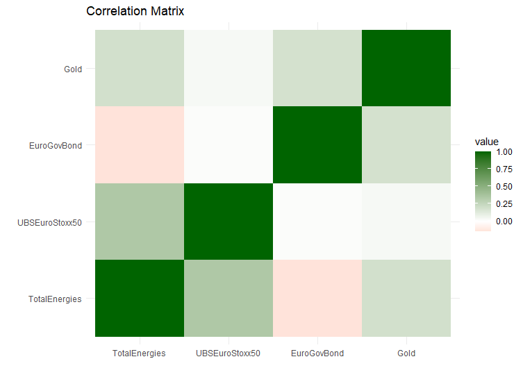
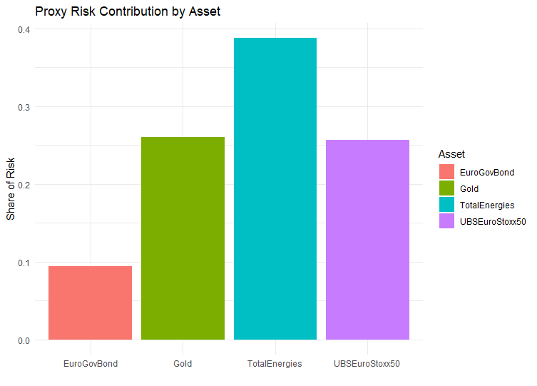

## README

Portfolio Risk Framework Simulation - Var and Stress Testing
============================
Laetitia Wouendji
April 2026

## Overview
*This project develops a portfolio risk framework in R to quantify downside risk and support allocation decisions. The model applies Value at Risk (VaR), Conditional VaR (CVaR), and stress testing to a multi-asset portfolio.*

## Portfolio Composition

Assets were selected to offer a broad risk exposure and were assumed to have equall weight within the portfolio:

1. TotalEnergies (Energy exposure)
2. Euro Stoxx ETF (Equity market)
3. Euro Government Bonds (Rates)
4. Gold (Defensive asset)

## Methodology
I imported daily log returns from market data on  yahoo Finance using the "get" function from tidyverse. Removed missing values then calculated the assets mean and volatility over the period.

                        Asset          Mean  Volatility
TotalEnergies   TotalEnergies  0.0007211235 0.016139195
UBSEuroStoxx50 UBSEuroStoxx50  0.0005361828 0.010667659
EuroGovBond       EuroGovBond -0.0001008505 0.003929694
Gold                     Gold  0.0007617096 0.010817160

### Correlation and diversification analysis.

The Correlation matrix highlighted an existing correlation between the asset, but a quasi-null correlation between the European Bond and TotalEnergies. Having assets in a portfolio with low to nil correlation is beneficial to build resilience during shock events.

<!-- -->

I then calculated the historical and parametric VaR(95%) and the Expected Shortfall for the portfolio to highlight the real amplitude of the risk, should the event happen.

            Portfolio
   HistVaR -0.01190464
   ParaVaR -0.01186999
   ES      -0.01753287 

I plotted a Proxy Risk contribution per Asset, which showed the disproportionate risk associated with the Total shares. This is as expected, based on teh assets volatility.

<!-- -->

### Stress Test

I put the portfolio through a series of stress events focusing on 3 key market shocks: 
  - Equity market crash
  - Interest Rate Shock
  - Energy price drop
  
The impact of these shock on each asset was speculative, while set to be economically coherent.
Portfolio Impact was calculated, showing a larger impact from Equity crash

     Scenario TotalEnergies EuroStoxx50 EuroGovBond  Gold
1 Equity Crash         -0.15       -0.20        0.03  0.08
2   Rate Shock         -0.03       -0.05       -0.06 -0.02
3  Energy Drop         -0.20       -0.08        0.01  0.04

  PortfolioImpact
1         -0.0600
2         -0.0400
3         -0.0575

### Portfolio Re-balancing

I decided to adjust the assets weight in the portfolio, specifically by reducing Total's portfolio share from 25% to 10% and reallocating to bonds and gold.

I potted the updated risk profile, showing that Gold now bears the highest risk, while begin the most stable asset. 
This set up is more resilient to market shock, and thsi can be seen in the VaR comparison below. 

<!-- -->

I then recalculated the historical VaR for the original and re-balanced portfolio.

               Metric    Original   Rebalanced
1  Historical VaR 95% -0.01190464 -0.009462382
2 Historical CVaR 95% -0.01753287 -0.013884195

