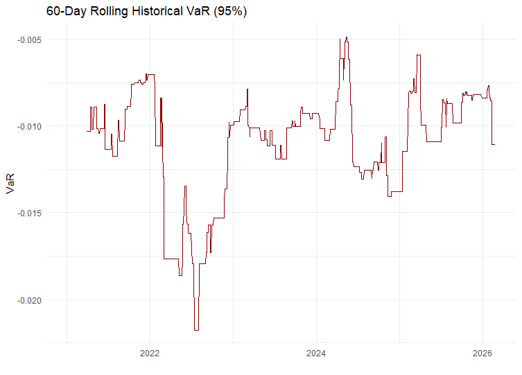
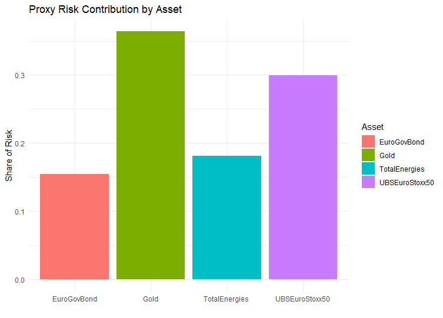

## README

Portfolio Risk Framework: VaR, Expected Shortfall, and Stress Testing in R
============================
Laetitia Wouendji
April 2026

## Overview
*This project develops an R-based portfolio risk framework to assess downside exposure and support allocation decisions. The analysis applies historical and parametric VaR, Expected Shortfall, correlation analysis, and scenario-based stress testing to a four-asset portfolio.*

## Portfolio Composition

Assets were selected to offer a broad risk exposure and were assumed to have equal weight within the portfolio:

1. TotalEnergies (Energy exposure)
2. Euro Stoxx ETF (Equity market)
3. Euro Government Bonds (Rates)
4. Gold (Defensive asset)

## Methodology

Daily log returns were imported from market data on Yahoo Finance. 
Missing values were removed to ensure consistent estimation of return and volatility metrics.

    Asset           Mean          Volatility
    TotalEnergies   0.0007211235  0.016139195
    UBSEuroStoxx50  0.0005361828  0.010667659
    EuroGovBond     -0.0001008505 0.003929694
    Gold            0.0007617096  0.010817160

### Correlation and diversification analysis.

The Correlation matrix highlights an existing correlation between the assets, but a low or near-zero correlation between the European Bond and TotalEnergies. Having assets in a portfolio with low to nil correlation is beneficial to build resilience during shock events.

<!-- -->

The portfolio historical and parametric VaR(95%) were calculated, alongside the Expected Shortfall  to highlight the real amplitude of the risk, should the event happen.

              Portfolio
    HistVaR   -0.01190464
    ParaVaR   -0.01186999
    ES        -0.01753287 

The Rolling VaR plot confirms losses up to -2.2% during the period between 2022 and 2023, highlighting the clear limitations of the VaR.

<!-- -->

## Stress Test

A Proxy Risk contribution per Asset plot shows the disproportionate risk associated with the Total shares in the scenario where all assets have equal weight. This is as expected, based on the assets’ volatility.

<!-- -->

The portfolio is subjected to three macro stress scenarios: 
  - Equity market crash
  - Interest Rate Shock
  - Energy price drop
  
The impact of these shocks on each asset was speculative, while set to be economically coherent. 
Stress losses (4–6%) significantly exceed VaR estimates (~1.2%), highlighting the limitations of standard risk measures under extreme market conditions.

        Scenario    TotalEnergies EuroStoxx50 EuroGovBond  Gold
    1 Equity Crash         -0.15       -0.20        0.03  0.08
    2   Rate Shock         -0.03       -0.05       -0.06 -0.02
    3  Energy Drop         -0.20       -0.08        0.01  0.04

          PortfolioImpact
    1         -0.0600
    2         -0.0400
    3         -0.0575

### Portfolio Re-balancing

The portfolio is rebalanced by reducing Total's portfolio share from 25% to 10% and reallocating to bonds and gold.

The new risk profile now shows Gold represents a larger share of portfolio risk after rebalancing, reflecting its increased weight and diversification role.

<!-- -->

The rebalanced portfolio demonstrates improved resilience under stress conditions. 

            Metric    			  Original    Rebalanced
    1  Historical VaR 95%   -0.01190464   -0.009462382
    2  Parametric VaR 95%   -0.01186999   -0.009629586
    3 Historical CVaR 95%   -0.01753287   -0.013884195

### Summary of Key Findings
  
- Daily historical VaR (95%): 1.19% 
- Daily Expected Shortfall (95%): 1.75%, indicating tail losses materially beyond VaR 
- Stress losses of 4.0% to 6.0% significantly exceed VaR estimates, highlighting model limitations under extreme events 
- Reallocating away from TotalEnergies toward bonds and gold reduced historical VaR and CVaR, improving portfolio resilience  

### Investment Interpretation

The results suggest downside risk is concentrated in equity and energy exposures. Under severe macro shocks, diversification benefits weaken and losses exceed normal-distribution-based risk estimates. A more defensive allocation improves resilience but may reduce upside participation.

## Next Steps

In the next iteration of this project, I will implement a "fat- tails" distribution such as Student to calibrate the risk further.
I could also enhance stress scenarios using historical or volatility-based calibration.
